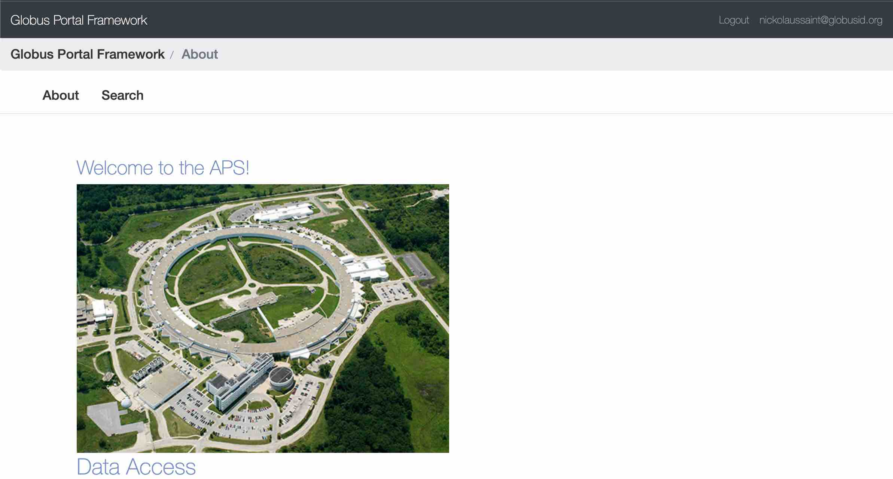

.. _previewing_content:

Previewing Content
==================

Images and other content hosted on a Globus Collection can be used to enrich
the content or search results on a portal.

Public Content Over HTTPS
-------------------------

For public images, the process is only a matter of constructing a valid link
to the Globus Collection, and the image will be displayed when the page loads.
Most GCSv5.4 collections support an HTTPS url for this exact purpose. The hostname
for a collection can be found by searching collections on the `Globus Webapp <https://app.globus.org/collections>`_
or via the Globus CLI:

.. code-block::

    $ globus collection show my-collection-uuid
    Display Name:                my-collection
    ...
    HTTPS URL:                   https://g-7581c.fd635.8444.data.globus.org

Links to files on a collection contain the HTTPS URL as a hostname in addition to
path to the desired file. Note the path must be correct, and the directory on the
collection must be shared with Public. The URL can be used on HTML img tags like the
example below:

.. code-block:: html

    

Private Content Over HTTPS
--------------------------

Accessing non-public data from a collection over HTTPS is a much more involved process,
and requires making the request to the resource using a Globus User bearer token scoped
for data_access on the exact collection it is desired. More info on accessing authorized
content from a `Globus Collection can be found here <https://docs.globus.org/globus-connect-server/v5/https-access-collections/#accessing_data>`_.

There is no easy way to access private data using only HTML. Django Globus Portal Framework
can be configured to request the data_access scope from Globus Auth, but additional support for
downloading the data and displaying it in HTML is not yet supported.